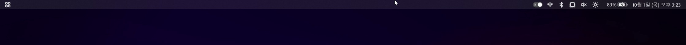
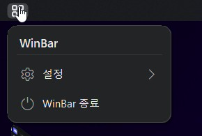
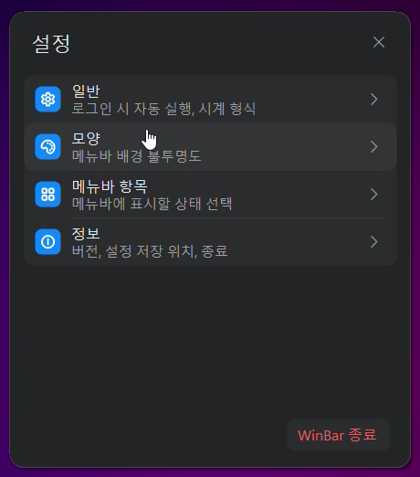
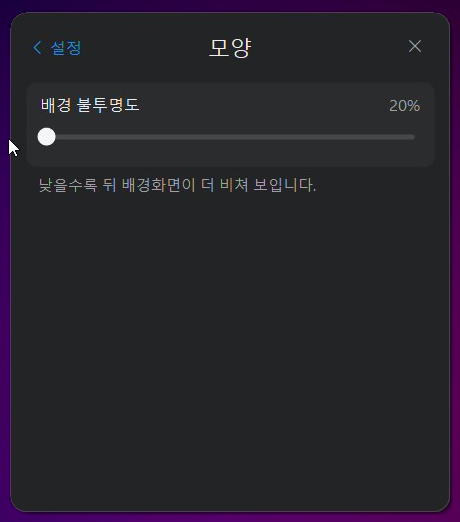

<div align="center">

# WinBar

**Windows 화면 맨 위에 맥(macOS)처럼 얇은 메뉴바를.**
컴퓨터 상태를 한눈에 보고, 음량·밝기는 바로 조절합니다.




</div>

## 한눈에 보기

<p align="center">
  
</p>

<p align="center"><sub>아이콘에 마우스를 올리면 자세한 값이 나오고, 한/영 스위치를 누르면 입력 언어가 바뀝니다.</sub></p>

<table>
  <tr>
    <td align="center" width="33%"><b>상태를 한 줄에</b><br><sub>CPU · GPU · 메모리 · 배터리 · 네트워크 · 음량 · 시간</sub></td>
    <td align="center" width="33%"><b>바로 조절</b><br><sub>음량·밝기는 메뉴바에서, 와이파이·블루투스는 Windows 설정으로</sub></td>
    <td align="center" width="33%"><b>가볍고 안전하게</b><br><sub>관리자 권한 없이, 설정은 이 PC에만 저장</sub></td>
  </tr>
</table>

## 1. 앱 이름과 한 줄 소개
**WinBar**는 Windows 화면 맨 위에 맥(macOS)처럼 얇은 메뉴바를 띄워, 컴퓨터 상태를 한눈에 보여 주는 앱입니다.

## 2. 누구를 위한 앱인가
- Windows에서도 맥북 메뉴바를 쓰고 싶은 사람
- 배터리, 와이파이, 음량 같은 상태를 여러 창을 열지 않고 깔끔하게 보고 싶은 사람

## 3. 할 수 있는 일
- 연결된 모든 모니터 맨 위에 메뉴바가 나타납니다.
- CPU, GPU, 메모리, 배터리(남은 시간 포함), 와이파이·유선 네트워크, 블루투스, 음량, 밝기, 날짜와 시각을 보여 줍니다.
- 카메라나 마이크를 쓰는 중이면 초록·주황 점으로 알려 줍니다.
- 한/영 상태를 스위치 모양으로 보여 주고, 스위치를 누르면 지금 쓰는 앱의 한/영이 바뀝니다.
- 음량과 화면 밝기는 메뉴바에서 바로 조절합니다. 와이파이·블루투스는 Windows 설정 화면으로 연결합니다.
- 충전기를 꽂거나 한/영 키를 누르면 바로 표시가 바뀝니다.
- 전체 화면일 때는 메뉴바가 위로 숨고, 마우스를 화면 맨 위에 대면 다시 내려옵니다.
- 창을 최대화해도 메뉴바가 창을 가리지 않습니다.
- 설정에서 표시할 항목, 24시간 시계, 배경 투명도(20~100%), 로그인 시 자동 실행을 고를 수 있습니다.

## 4. 사용 방법
1. **상태 보기**: 메뉴바의 아이콘에 마우스를 올리면 자세한 값이 작은 창으로 나옵니다.
2. **조절하기**: 음량·밝기 아이콘을 누르고 막대를 움직입니다. 와이파이·블루투스 아이콘을 누르면 Windows 설정으로 갈 수 있습니다.
3. **설정 바꾸기**: 맨 왼쪽 로고를 누르고 `설정`을 고릅니다. 바깥을 누르거나 Esc를 누르면 닫힙니다.
4. **끄기**: 맨 왼쪽 로고를 누르고 `WinBar 종료`를 고릅니다.

<table>
  <tr>
    <td align="center"></td>
    <td align="center"></td>
    <td align="center"></td>
  </tr>
  <tr>
    <td align="center"><sub>로고 메뉴</sub></td>
    <td align="center"><sub>설정</sub></td>
    <td align="center"><sub>배경 불투명도</sub></td>
  </tr>
</table>

## 5. 실행 방법
1. Windows 10 또는 11에 .NET 10 SDK를 설치합니다.
2. 이 폴더에서 아래 명령으로 앱을 만듭니다.
   ```powershell
   dotnet build WinBar.csproj -c Release
   ```
3. `bin\Release\net10.0-windows\WinBar.exe`를 실행합니다. 관리자 권한은 필요 없습니다.

## 6. 확인 방법
자세한 점검 순서는 [docs/checklist.md](docs/checklist.md)에 있습니다. 핵심 항목은 다음과 같습니다.
- 빌드할 때 오류가 없고, 실행 중에 앱이 멈추거나 꺼지지 않는다.
- 모든 모니터 맨 위에 메뉴바가 보인다.
- CPU·GPU·메모리·배터리·네트워크·음량·시간이 보이고, 음량·밝기를 조절할 수 있다.
- 껐다 켜도 설정이 그대로 남아 있다.
- 가만히 둘 때 CPU는 평균 1% 이하, 메모리는 40MB 이하이다. (마지막 측정: CPU 0.17%, 메모리 최대 34.2MB)

## 7. 데이터 저장 안내
- 설정은 이 컴퓨터의 `%LOCALAPPDATA%\WinBar\settings.ini` 파일에만 저장됩니다.
- 인터넷으로 보내지 않으므로, 다른 컴퓨터나 다른 Windows 계정에서는 보이지 않습니다.
- 저장되는 것은 표시 항목, 시계 형식, 배경 투명도 같은 화면 설정뿐입니다. 키보드로 친 내용이나 개인 정보는 저장하지 않습니다.

## 8. 만든 과정
- **프롬프트 엔지니어링**: `docs/plan.md`와 `docs/prompt-design.md`에 목표, 제약, 성능 기준을 숫자로 정해 AI에게 모호하지 않게 요청했습니다.
- **하네스 엔지니어링**: `AGENTS.md`에 작업 규칙, 허락이 필요한 일, 완료 기준, 확인 절차를 적어 AI가 정해진 틀 안에서만 일하게 했습니다.
- **루프 엔지니어링**: 실행 → 측정·화면 확인 → 실패 기준 수정을 반복하고, 같은 문제는 3번까지만 고치도록 정해 [docs/loop-log.md](docs/loop-log.md)에 기록했습니다.

## 9. 배포 주소
배포 후 추가

## 10. AI 활용 표시
이 앱은 AI 코딩 도우미(Codex, Claude Code)의 도움을 받아 만들었고, 사람이 직접 실행하고 검증했습니다.

## 알려진 문제
- 설치 프로그램은 아직 없습니다. 지금은 위의 실행 방법으로만 쓸 수 있습니다.
- 모니터를 여러 대 연결한 실제 환경에서는 아직 확인하지 못했습니다.
- 다른 앱이 화면 맨 위를 계속 덮고 있으면, 마우스를 올린 뒤 최대 0.5초 뒤에 메뉴바를 누를 수 있습니다.
- 크롬처럼 일부 앱에서는 Windows가 알려 주는 한/영 값이 늦거나 틀려서, 표시가 실제와 다를 수 있습니다.
- 충전기를 꽂았을 때 반영되는 시간과 작업 표시줄의 한/영 단추로 바꿨을 때의 동작은 사람이 직접 확인해야 합니다.
